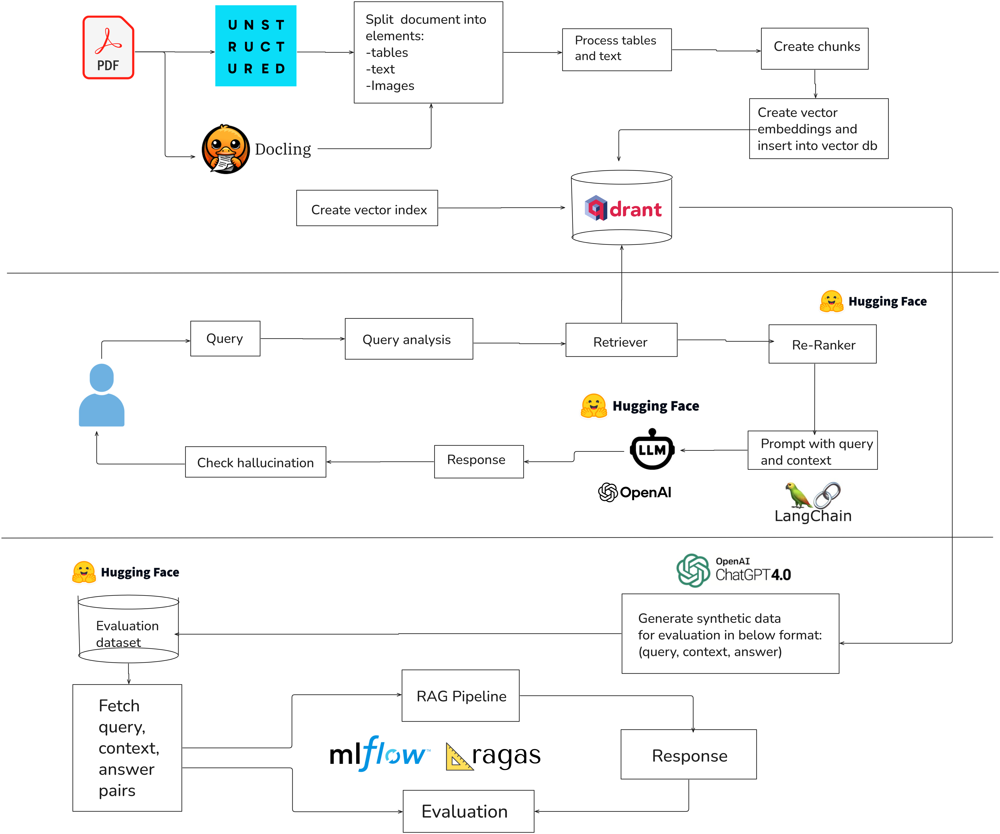

# Production RAG Pipeline

This project implements a Retrieval-Augmented Generation (RAG) system using unstructured and docling to parse real worl documents.

## Architecture



## Setup

```bash
pip install -r requirements.txt
python main.py
```

## Description

The pipeline includes:
- Unstructured document parsing
- Vector storage
- Retrieval and response generation
- RAG evaluation
